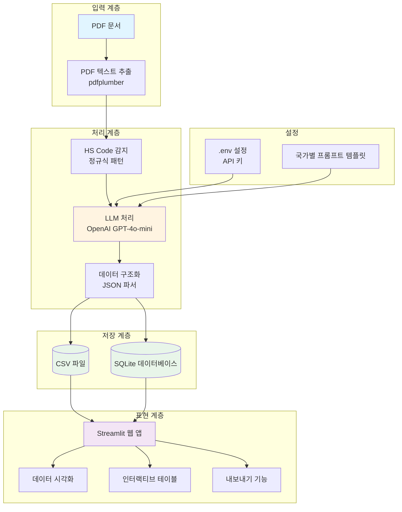
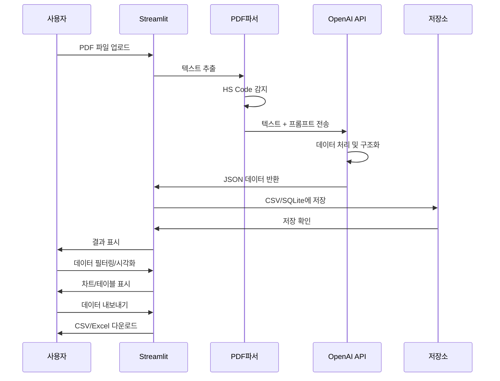

<div align="center">

# 🏭 철강 관세 분석 시스템

### AI 기반 철강 제품 관세 및 반덤핑 전문 분석 플랫폼
### Steel Tariff Analysis System

[](https://www.python.org/)
[](https://streamlit.io/)
[](https://openai.com/)
[](https://pandas.pydata.org/)
[](LICENSE)

---

</div>

## 📋 목차

- [개요](#개요)
- [주요 기능](#주요-기능)
- [기술 스택](#기술-스택)
- [시스템 아키텍처](#시스템-아키텍처)
- [스크린샷](#스크린샷)
- [설치 방법](#설치-방법)
- [사용 방법](#사용-방법)
- [프로젝트 구조](#프로젝트-구조)
- [데이터 스키마](#데이터-스키마)
- [지원 국가](#지원-국가)
- [개발 가이드](#개발-가이드)
- [문제 해결](#문제-해결)
- [향후 개발 계획](#향후-개발-계획)

---

## 🎯 개요

**철강 관세 분석 시스템**은 각국 정부의 반덤핑 및 상계관세 문서에서 철강 제품 관세 정보를 자동으로 추출하고 분석하는 지능형 플랫폼입니다. OpenAI의 GPT-4o-mini API를 활용하여 여러 국가의 PDF 문서를 처리하고 데이터를 쿼리 가능한 형식으로 구조화합니다.

### 🌟 핵심 특징

- **🤖 AI 기반 추출**: GPT-4o-mini를 활용하여 비구조화된 PDF 문서에서 지능적으로 데이터 구조화
- **🌍 다국가 지원**: 미국, EU, 말레이시아, 호주, 파키스탄의 관세 문서 처리
- **📊 인터랙티브 대시보드**: Streamlit 기반 웹 인터페이스로 데이터 시각화 및 분석
- **🔍 스마트 HS Code 감지**: 정규식 패턴을 사용한 자동 HS Code 추출
- **💾 이중 저장**: CSV 및 SQLite 데이터베이스 형식 모두 지원
- **📈 실시간 분석**: 동적 필터링, 통계 및 내보내기 기능

---

## ✨ 주요 기능

### 핵심 기능

| 기능 | 설명 |
|------|------|
| **PDF 파싱** | `pdfplumber` 라이브러리를 사용한 고품질 텍스트 추출 |
| **HS Code 추출** | HS Code 자동 감지 및 추출 (형식: XXXX.XX.XXXX) |
| **AI 데이터 구조화** | GPT-4o-mini API가 비구조화된 텍스트를 구조화된 JSON 데이터로 변환 |
| **CSV 관리** | 자동 중복 제거를 통한 점진적 데이터 누적 |
| **웹 인터페이스** | 여러 페이지를 가진 사용자 친화적인 Streamlit 대시보드 |
| **데이터 시각화** | 통계 차트 및 인터랙티브 데이터 테이블 |
| **다국가 템플릿** | 최적의 추출을 위한 국가별 LLM 프롬프트 템플릿 |
| **내보내기 옵션** | 커스터마이징 가능한 필터링을 통한 CSV 및 Excel 내보내기 |

### 웹 애플리케이션 페이지

1. **PDF 처리 페이지**
   - HS Code 및 상세 PDF 파일 업로드
   - 국가 선택
   - 실시간 추출 진행 상황
   - 데이터 미리보기 및 다운로드

2. **대화형 검색**
   - 관세 데이터의 자연어 쿼리
   - AI 기반 검색 결과

3. **데이터 시각화 대시보드**
   - 정렬 및 필터링이 가능한 인터랙티브 데이터 테이블
   - 통계 분석 및 차트
   - 국가, 회사, 케이스 번호, HS Code별 고급 필터링
   - 내보내기 기능 (CSV/Excel)

---

## 🛠️ 기술 스택

### 🤖 AI & LLM

| 기술 | 버전 | 용도 |
|------|------|------|
|  | 2.9.0 | 지능형 데이터 추출을 위한 GPT-4o-mini API |
|  | 2.12.5 | LLM용 데이터 검증 및 설정 관리 |
|  | 8.5.0 | 지수 백오프를 사용한 API 호출 재시도 로직 |
|  | 0.12.0 | LLM 응답을 위한 고속 JSON 파싱 |

### 🐍 백엔드 & 코어

| 기술 | 버전 | 용도 |
|------|------|------|
|  | 3.8+ | 핵심 프로그래밍 언어 |
|  | 2.2.2 | 데이터 조작 및 분석 |
|  | 1.26.4 | 수치 계산 |
|  | 22.0.0 | 효율적인 저장을 위한 컬럼형 데이터 포맷 |

### 📄 PDF 처리

| 기술 | 버전 | 용도 |
|------|------|------|
|  | 0.11.0 | 고품질 PDF 텍스트 추출 |
|  | 20231228 | PDF 파싱 엔진 및 레이아웃 분석 |
|  | 5.1.0 | 고속 PDF 렌더링 라이브러리 |
|  | 10.4.0 | 이미지 처리 및 조작 |

### 🌐 웹 프레임워크 & UI

| 기술 | 버전 | 용도 |
|------|------|------|
|  | 1.35.0 | 인터랙티브 웹 애플리케이션 프레임워크 |
|  | 6.5.2 | Streamlit용 비동기 웹 서버 |
|  | 5.5.0 | 선언적 통계 시각화 |
|  | 0.9.1 | WebGL 기반 데이터 시각화 |
|  | 3.1.6 | 동적 콘텐츠를 위한 템플릿 엔진 |

### 🌐 HTTP & 네트워킹

| 기술 | 버전 | 용도 |
|------|------|------|
|  | 2.32.5 | API 호출을 위한 HTTP 라이브러리 |
|  | 0.28.1 | HTTP/2 지원 비동기 HTTP 클라이언트 |
|  | 1.0.9 | 저수준 HTTP 전송 |
|  | 2.6.1 | 연결 풀링을 지원하는 HTTP 클라이언트 |
|  | 2025.11.12 | SSL/TLS용 루트 인증서 |

### 💾 데이터 저장 & 내보내기

| 기술 | 버전 | 용도 |
|------|------|------|
|  | Built-in | 경량 관계형 데이터베이스 |
|  | Native | 기본 데이터 저장 형식 |
|  | 3.1.2 | Excel XLSX 파일 생성 및 내보내기 |

### ✅ 데이터 검증 & 스키마

| 기술 | 버전 | 용도 |
|------|------|------|
|  | 2.12.5 | Python 타입 힌트를 사용한 데이터 검증 |
|  | 4.25.1 | JSON 데이터 검증 |
|  | 25.4.0 | 보일러플레이트 없는 Python 클래스 |

### 📝 마크다운 & 문서화

| 기술 | 버전 | 용도 |
|------|------|------|
|  | 4.0.0 | CommonMark 지원 마크다운 파서 |
|  | 2.19.2 | 코드 블록 구문 강조 |
|  | 13.9.4 | 아름다운 터미널 포맷팅 및 로깅 |

### 🔧 개발 도구 & 유틸리티

| 기술 | 버전 | 용도 |
|------|------|------|
|  | 1.0.1 | .env 파일에서 환경 변수 관리 |
|  | 8.3.1 | 명령줄 인터페이스 생성 |
|  | 4.67.1 | 루프 및 반복을 위한 진행률 표시줄 |
|  | 6.0.0 | 파일 시스템 이벤트 모니터링 |
|  | 5.5.2 | 확장 가능한 메모이제이션 컬렉션 및 데코레이터 |

### 🔐 버전 관리 & Git

| 기술 | 버전 | 용도 |
|------|------|------|
|  | Latest | 버전 관리 시스템 |
|  | 3.1.45 | Git 저장소 상호작용을 위한 Python 라이브러리 |
|  | 4.0.12 | GitPython용 Git 객체 데이터베이스 |
|  | 5.0.2 | Git용 메모리 맵 파일 지원 |

### 🔒 보안 & 암호화

| 기술 | 버전 | 용도 |
|------|------|------|
|  | 46.0.3 | 암호화 레시피 및 기본 요소 |
|  | 2.0.0 | Python용 C 외부 함수 인터페이스 |

### 📦 시스템 & 플랫폼

| 기술 | 버전 | 용도 |
|------|------|------|
|  | 24.2 | Python 패키지용 핵심 유틸리티 |
|  | 0.10.2 | TOML 구성 파일 파서 |
|  | 4.25.8 | Protocol Buffers 데이터 직렬화 |
|  | 2025.2 | 세계 시간대 정의 |
|  | 2025.2 | IANA 시간대 데이터베이스 |

### 📊 총 의존성

**65개 이상의 Python 패키지**가 최적의 성능과 기능을 위해 신중하게 선택되었습니다

---

## 🏗️ 시스템 아키텍처

### 시스템 아키텍처 다이어그램



### 데이터 플로우



---

## 📸 스크린샷

### 1. PDF 처리 인터페이스
*AI 기반 분석으로 PDF 문서를 업로드하고 관세 데이터를 추출합니다*

```
┌─────────────────────────────────────────────────────────────┐
│  🏭 철강 관세 분석 시스템                                    │
├─────────────────────────────────────────────────────────────┤
│                                                             │
│  📄 문서 업로드                                              │
│  ┌──────────────────┐  ┌──────────────────┐               │
│  │  HS Code PDF     │  │  상세 PDF        │               │
│  │  [찾아보기...]   │  │  [찾아보기...]   │               │
│  └──────────────────┘  └──────────────────┘               │
│                                                             │
│  🌍 국가 선택: [USA ▼]                                      │
│                                                             │
│  ┌─────────────────────────┐                               │
│  │   데이터 추출           │                               │
│  └─────────────────────────┘                               │
│                                                             │
│  📊 추출된 데이터 미리보기                                   │
│  ┌───────────────────────────────────────────────────┐    │
│  │ HS Code    │ 국가    │ 관세율     │ 회사          │    │
│  ├───────────────────────────────────────────────────┤    │
│  │ 7209.15... │ Korea   │ 0.00%      │ 현대제철      │    │
│  │ 7225.50... │ Korea   │ 5.52%      │ POSCO        │    │
│  └───────────────────────────────────────────────────┘    │
└─────────────────────────────────────────────────────────────┘
```

> **참고**: `assets/` 디렉토리에 실제 스크린샷을 추가하세요:
> - `assets/screenshot-upload.png` - PDF 업로드 인터페이스
> - `assets/screenshot-processing.png` - 데이터 추출 진행 중
> - `assets/screenshot-results.png` - 추출된 데이터 미리보기

### 2. 데이터 시각화 대시보드
*인터랙티브 테이블, 차트 및 필터링 옵션*

```
┌─────────────────────────────────────────────────────────────┐
│  📊 관세 데이터 대시보드                                     │
├─────────────────────────────────────────────────────────────┤
│  필터: 국가 [전체 ▼] 회사 [전체 ▼] HS Code [____]          │
│                                                             │
│  📈 통계                                                     │
│  ┌────────────┬────────────┬────────────┬────────────┐    │
│  │ 전체 레코드│ 국가       │ 회사       │ HS Code    │    │
│  │   2,053    │     5      │    127     │    156     │    │
│  └────────────┴────────────┴────────────┴────────────┘    │
│                                                             │
│  📊 관세율 분포                                              │
│  ▓▓▓▓▓▓▓▓▓░░░░░░░░░░  0-5%:   45%                         │
│  ▓▓▓▓▓░░░░░░░░░░░░░░  5-10%:  25%                         │
│  ▓▓▓░░░░░░░░░░░░░░░░  10-20%: 18%                         │
│  ▓░░░░░░░░░░░░░░░░░░  20%+:   12%                         │
└─────────────────────────────────────────────────────────────┘
```

> **참고**: 대시보드 스크린샷 추가:
> - `assets/screenshot-dashboard.png` - 메인 대시보드 뷰
> - `assets/screenshot-charts.png` - 통계 시각화
> - `assets/screenshot-export.png` - 내보내기 기능

### 3. 국가 커버리지 맵
*지원 국가의 시각적 표현*

```
          🇺🇸 미국 (15개 문서)

    🇪🇺 EU                    🇵🇰 파키스탄
 (2개 문서)                  (1개 문서)

        🇲🇾 말레이시아
        (5개 문서)

        🇦🇺 호주
       (2개 문서)
```

---

## 🚀 설치 방법

### 사전 요구사항

- Python 3.8 이상
- OpenAI API 키
- 4GB 이상의 RAM 권장
- 운영 체제: macOS, Linux 또는 Windows

### 단계별 가이드

#### 1. 저장소 클론

```bash
git clone <repository-url>
cd Lee_pro
```

#### 2. 가상환경 생성

```bash
# 가상환경 생성
python -m venv venv

# 가상환경 활성화
# macOS/Linux:
source venv/bin/activate

# Windows:
venv\Scripts\activate
```

#### 3. 의존성 설치

```bash
pip install -r requirements.txt
```

#### 4. 환경 변수 설정

프로젝트 루트에 `.env` 파일을 생성합니다:

```bash
# 예제 환경 파일 복사
cp .env.example .env

# .env를 편집하여 OpenAI API 키 추가
echo "OPENAI_API_KEY=sk-your-actual-api-key-here" > .env
```

OpenAI API 키 발급: [OpenAI Platform](https://platform.openai.com/api-keys)

#### 5. PDF 파일 준비

`PDF/` 디렉토리에 PDF 문서를 배치합니다:

```bash
PDF/
├── USA_CR_Antidumping_A-580-881.pdf
├── MALAYSIA_STS_CR_Antidumping_PUA197_VIETNAM.pdf
└── ... (기타 PDF 파일)
```

---

## 💻 사용 방법

### 방법 1: Streamlit 웹 인터페이스 (권장)

#### 애플리케이션 실행

```bash
streamlit run streamlit_app.py
```

브라우저가 자동으로 `http://localhost:8501`에서 열립니다

#### 웹 인터페이스 사용하기

**PDF 처리 페이지:**
1. 두 개의 PDF 파일 업로드:
   - HS Code PDF (HS code 목록 포함)
   - 상세 PDF (상세 관세 정보 포함)
2. 드롭다운에서 발행 국가 선택
3. "Extract Data" 버튼 클릭
4. 미리보기 테이블에서 추출된 데이터 검토
5. 결과를 CSV로 다운로드

**데이터 시각화 페이지:**
- **데이터 테이블 탭**: 정렬 기능이 있는 모든 추출된 레코드 탐색
- **통계 탭**: 차트 및 통계 분석 보기
- **필터 탭**: 국가, 회사, 케이스 번호 또는 HS Code로 필터링
- **내보내기 탭**: 필터링된 데이터를 CSV 또는 Excel로 다운로드

### 방법 2: 대체 대시보드

```bash
streamlit run streamlit_app2.py
```

관세 데이터 탐색 및 내보내기에 집중된 뷰를 제공합니다.

### 방법 3: 커맨드 라인 인터페이스

```bash
python llm.py
```

`PDF/` 디렉토리의 모든 PDF를 자동으로 처리하고 결과를 `CSV/`에 저장합니다.

#### SQLite 변형 사용

```bash
python llm_sqlite.py
```

CSV 대신 SQLite 데이터베이스(`DB/tariff_data.db`)에 데이터를 저장합니다.

---

## 📁 프로젝트 구조

```
Lee_pro/
├── 📄 README.md                          # 이 문서 파일
├── ⚙️  requirements.txt                   # Python 의존성
├── 🔐 .env                               # 환경 변수 (생성 필요)
├── 🔐 .env.example                       # 환경 변수 템플릿
├── 🚫 .gitignore                         # Git 무시 규칙
│
├── 📂 PDF/                               # 입력 PDF 문서 (8.6 MB)
│   ├── USA_CR_Antidumping_A-580-881.pdf
│   ├── MALAYSIA_STS_CR_Antidumping_PUA197_VIETNAM.pdf
│   ├── EU_GO_Antidumping_AD608_R728.pdf
│   ├── AUSTRALIA_Zinc_Coated_Antidumping_ADN_2023_035.pdf
│   └── PAKISTAN_CR_Antidumping_A.D.C_No._60.pdf
│   └── ... (총 25개 PDF 파일)
│
├── 📂 CSV/                               # 출력 CSV 파일 (524 KB)
│   └── tariff_data.csv                   # 메인 추출 데이터 (2,053개 레코드)
│
├── 📂 DB/                                # SQLite 데이터베이스 파일 (780 KB)
│   └── tariff_data.db                    # 대체 저장 형식
│
├── 📂 prompt_templet/                    # 국가별 LLM 프롬프트 (36 KB)
│   ├── usa_prompt.txt                    # 미국 추출 지침
│   ├── malaysia_prompt.txt               # 말레이시아 추출 지침
│   ├── eu_prompt.txt                     # EU 추출 지침
│   ├── australia_prompt.txt              # 호주 추출 지침
│   └── pakistan_prompt.txt               # 파키스탄 추출 지침
│
├── 📂 assets/                            # 이미지 및 스크린샷
│   ├── screenshot-upload.png             # (여기에 스크린샷 추가)
│   ├── screenshot-dashboard.png
│   └── architecture-diagram.png
│
├── 🐍 llm.py                             # 핵심 분석 엔진 (810줄)
├── 🐍 llm_sqlite.py                      # SQLite 변형 (1,007줄)
├── 🌐 streamlit_app.py                   # 메인 웹 인터페이스 (663줄)
└── 🌐 streamlit_app2.py                  # 대체 대시보드 (1,145줄)
```

### 파일 설명

| 파일 | 줄 수 | 용도 |
|------|-------|------|
| `llm.py` | 810 | PDF 처리 및 OpenAI 통합을 포함한 핵심 LLM 기반 분석 엔진 |
| `llm_sqlite.py` | 1,007 | 영구 저장을 위한 SQLite 데이터베이스 변형 |
| `streamlit_app.py` | 663 | 업로드 및 시각화를 포함한 주요 Streamlit 웹 인터페이스 |
| `streamlit_app2.py` | 1,145 | 데이터 탐색에 집중된 대체 대시보드 |

---

## 📊 데이터 스키마

### 출력 CSV 구조

추출된 데이터는 14개의 컬럼을 포함합니다:

| 컬럼명 | 타입 | 설명 | 예시 |
|--------|------|------|------|
| `id` | Integer | 자동 증가 고유 식별자 | 1 |
| `hs_code` | String | 통일상품명 및 부호체계(HS) 코드 | 7209.15.0000 |
| `issuing_country` | String | 관세를 발행한 국가 | USA |
| `country` | String | 관세 대상 국가 | Korea |
| `tariff_type` | String | 관세 유형 | Antidumping / Countervailing |
| `tariff_rate` | Float | 관세율 백분율 | 0.00 / 5.52 |
| `effective_date_from` | Date | 발효 시작일 | 2025-01-15 |
| `effective_date_to` | Date | 발효 종료일 (해당되는 경우) | 2026-01-14 |
| `investigation_period_from` | Date | 조사 기간 시작 | 2022-09-01 |
| `investigation_period_to` | Date | 조사 기간 종료 | 2023-08-31 |
| `company` | String | 회사명 | Hyundai Steel Company |
| `case_number` | String | 공식 케이스 식별자 | A-580-881 |
| `product_description` | String | 제품 카테고리 설명 | Certain Cold-Rolled Steel Flat Products |
| `note` | String | 추가 메모 또는 컨텍스트 | Final results of AD administrative review |

### 샘플 데이터

```csv
id,hs_code,issuing_country,country,tariff_type,tariff_rate,effective_date_from,company,case_number,product_description
1,7209.15.0000,USA,Korea,Antidumping,0.00,2025-01-15,Hyundai Steel Company,A-580-881,Certain Cold-Rolled Steel Flat Products
2,7209.16.0030,USA,Korea,Antidumping,5.52,2025-01-15,POSCO,A-580-881,Certain Cold-Rolled Steel Flat Products
3,7225.50.6000,USA,Korea,Countervailing,3.18,2025-01-15,Dongkuk Steel Mill Co.,C-580-882,Certain Cold-Rolled Steel Flat Products
```

---

## 🌍 지원 국가

시스템은 현재 다음 관할 구역의 관세 문서를 지원합니다:

| 국가/지역 | 문서 수 | 문서 유형 | 프롬프트 템플릿 |
|-----------|---------|-----------|-----------------|
| 🇺🇸 **미국** | 15 | 상무부 AD/CVD 최종 결정 | `usa_prompt.txt` |
| 🇪🇺 **유럽연합** | 2 | 공식 저널 반덤핑 지침 | `eu_prompt.txt` |
| 🇲🇾 **말레이시아** | 5 | 관세청 반덤핑 관세 명령 (PUA) | `malaysia_prompt.txt` |
| 🇦🇺 **호주** | 2 | 반덤핑 공고 (ADN) | `australia_prompt.txt` |
| 🇵🇰 **파키스탄** | 1 | 무역/반덤핑 결정 | `pakistan_prompt.txt` |

### 문서 커버리지

- **총 문서 수**: 25개 PDF 파일 (8.6 MB)
- **총 추출 레코드**: 2,053개 관세 항목
- **날짜 범위**: 2016-2023년
- **제품 카테고리**: 냉간압연강, 도금강, 열간압연강, 후판강, 아연도금강

### 새로운 국가 추가하기

새 국가 지원을 추가하려면:

1. `prompt_templet/`에 새 프롬프트 템플릿 생성
2. 문서 형식 및 구조 연구
3. 최적의 추출을 위해 LLM 지침 커스터마이징
4. Streamlit 인터페이스에 국가 선택 추가
5. 샘플 문서로 테스트

---

## 🔧 개발 가이드

### 코드 품질

```bash
# 개발 의존성 설치
pip install black flake8 mypy pytest

# 코드 포맷팅
black *.py

# 코드 린트
flake8 *.py

# 타입 체크
mypy *.py

# 테스트 실행 (사용 가능한 경우)
pytest tests/
```

### 로깅

모든 작업은 상세한 정보와 함께 로깅됩니다:

```python
# 사용되는 로그 레벨:
- INFO: 정상 작업 진행 상황
- WARNING: 중요하지 않은 문제
- ERROR: 실패 및 예외
```

로그 출력 예시:

```
2025-01-15 10:30:00 - __main__ - INFO - Extracting text from PDF/USA_CR_Antidumping_A-580-881_2016.pdf
2025-01-15 10:30:05 - __main__ - INFO - Found 15 unique HS codes
2025-01-15 10:30:10 - __main__ - INFO - Calling OpenAI API (attempt 1/3)
2025-01-15 10:30:15 - __main__ - INFO - Successfully parsed 2 records
2025-01-15 10:30:20 - __main__ - INFO - Saved 2 new records to CSV/tariff_data.csv
```

### 환경 변수

| 변수 | 필수 | 설명 |
|------|------|------|
| `OPENAI_API_KEY` | 예 | GPT-4o-mini 액세스를 위한 OpenAI API 키 |

---

## 🐛 문제 해결

### 일반적인 문제

#### 1. API 키를 찾을 수 없음

**오류:**
```
ValueError: OpenAI API key not found
```

**해결 방법:**
- 프로젝트 루트에 `.env` 파일이 있는지 확인
- `OPENAI_API_KEY`가 올바르게 설정되었는지 확인
- 키에 추가 공백이나 따옴표가 없는지 확인
- `.env` 수정 후 애플리케이션 재시작

#### 2. PDF 파일을 찾을 수 없음

**오류:**
```
ERROR: HS Code PDF not found at path: PDF/document.pdf
```

**해결 방법:**
- PDF 파일이 `PDF/` 디렉토리에 있는지 확인
- 파일 이름이 예상 패턴과 일치하는지 확인
- 적절한 파일 권한 확인

#### 3. JSON 파싱 오류

**오류:**
```
JSONDecodeError: Expecting value: line 1 column 1 (char 0)
```

**해결 방법:**
- 시스템이 자동으로 최대 3회 재시도합니다
- 지속적인 실패 시 OpenAI API 상태 확인
- 프롬프트 템플릿 형식 확인
- 로그에서 LLM 응답 검토

#### 4. 메모리 문제

**오류:**
```
MemoryError: Unable to allocate array
```

**해결 방법:**
- 다른 애플리케이션을 닫아 RAM 확보
- 먼저 작은 PDF 파일 처리
- 시스템 스왑 공간 증가
- 더 나은 메모리 효율성을 위해 SQLite 변형 사용

#### 5. 인코딩 문제

**오류:**
```
UnicodeDecodeError: 'utf-8' codec can't decode byte
```

**해결 방법:**
- CSV 파일은 UTF-8 BOM 인코딩으로 저장됩니다
- Excel에서 UTF-8 인코딩으로 CSV 파일 열기
- 올바른 표시를 위해 Streamlit 인터페이스 사용

---

## 🗺️ 향후 개발 계획

### 계획된 기능

- [ ] **국가 지원 확대**
  - [ ] 중국 반덤핑 문서
  - [ ] 캐나다 CBSA 결정
  - [ ] 일본 METI 공고
  - [ ] 브라질 MDIC 결의

- [ ] **향상된 처리**
  - [ ] 여러 PDF를 위한 배치 처리
  - [ ] 더 빠른 추출을 위한 병렬 처리
  - [ ] 스캔된 PDF용 OCR 지원
  - [ ] 다국어 문서 지원

- [ ] **데이터 관리**
  - [ ] 고급 데이터 검증 규칙
  - [ ] 중복 감지 개선
  - [ ] 과거 데이터 버전 관리
  - [ ] 데이터 품질 점수

- [ ] **API & 통합**
  - [ ] RESTful API 엔드포인트
  - [ ] 웹훅 알림
  - [ ] 외부 데이터베이스 통합 (PostgreSQL, MongoDB)
  - [ ] 인증 및 사용자 관리

- [ ] **분석 & 보고**
  - [ ] 자동화된 보고서 생성
  - [ ] 업데이트에 대한 이메일 알림
  - [ ] 추세 분석 및 예측
  - [ ] 국가 간 비교 분석

- [ ] **사용자 인터페이스**
  - [ ] 다크 모드 지원
  - [ ] 모바일 반응형 디자인
  - [ ] 필터가 있는 고급 검색
  - [ ] 커스터마이징 가능한 대시보드

---

## 📄 라이선스

이 프로젝트는 독점적이며 내부 사용 전용입니다.

## 🤝 기여

기여를 환영합니다! 이슈를 제출하거나 풀 리퀘스트를 자유롭게 보내주세요.

## 📧 연락처 및 지원

질문, 문제 또는 기능 요청이 있으시면 저장소에 이슈를 열어주세요.

---

<div align="center">

**Python, Streamlit 및 OpenAI로 만든 프로젝트입니다 ❤️**

[⬆ 맨 위로](#-철강-관세-분석-시스템)

</div>
